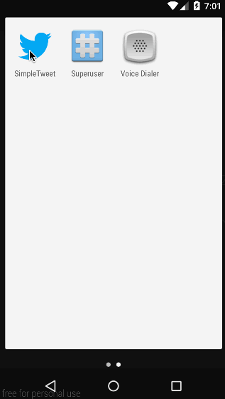

# SimpleTweet (Twitter Client)
Personal Twitter Client using [Twitter API](https://dev.twitter.com/)

## Features
- User can sign in to Twitter using OAuth login

- User can view the tweets from their home timeline
	- User should be displayed the username, name, and body for each tweet
	- User should be displayed the relative timestamp for each tweet "8m", "7h"
	- User can view more tweets as they scroll with infinite pagination

- User can compose a new tweet
	- User can click a “Compose” icon in the Action Bar on the top right
	- User can then enter a new tweet and post this to twitter
User is taken back to home timeline with new tweet visible in timeline

## Development Tools
- Android Studio
- Development time: 10 hours

## Demo

## Acknowledgement
- [CodePath](http://codepath.com)
- Android CodePath Observer Group Feb 2015
- [android-async-http](http://loopj.com/android-async-http/)
- [Picasso](http://square.github.io/picasso/)